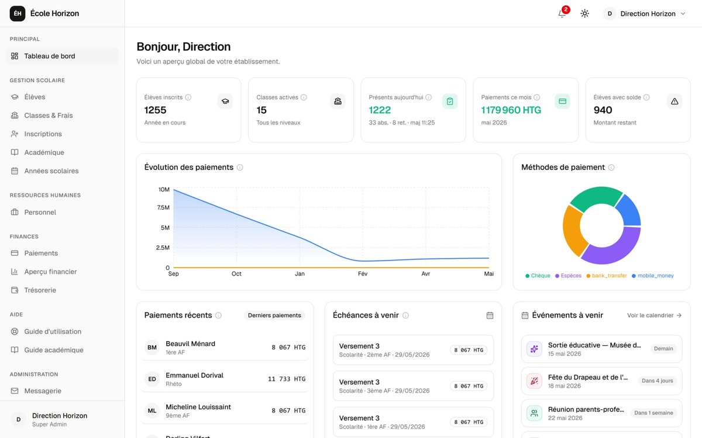
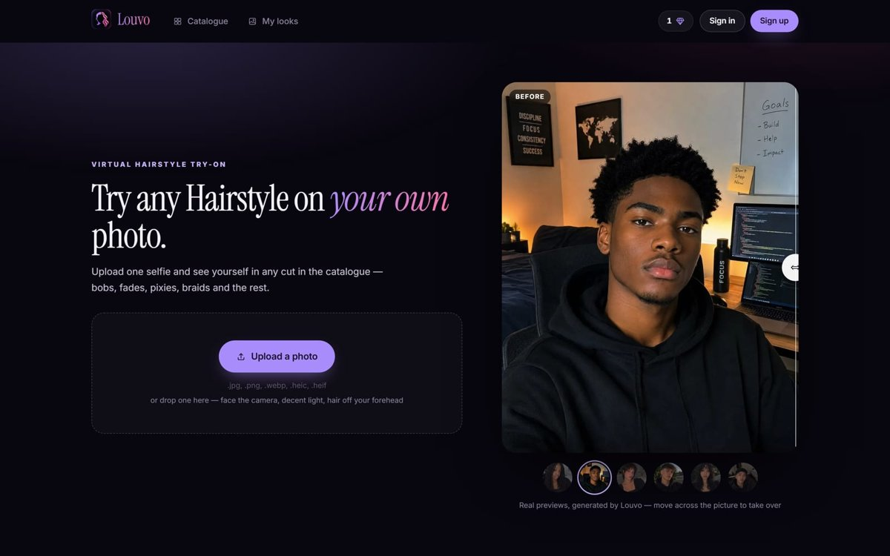

# Hi, I'm Rodarly 👋

 

---

### About me

I'm a 19-year-old computer science student and full-stack developer. I taught myself to code after finishing
high school in 2025, and I've been shipping real software ever since.

- 🏫 I built **[Formel](https://www.formelapp.com)**, a school management platform my family's private school in Haiti runs on every day, with more than 400 users
- 💇 I'm building **[Louvo](https://www.louvo.app)**, an AI hairstyle try-on on the web and mobile
- 🌱 I learn fast and care about the whole product: the database, the API, the interface and the people using it
- 🗣️ I speak English, French and Haitian Creole

---

### Featured projects

<table>
  <tr>
    <td width="50%" valign="top">
      
      <h3><a href="https://www.formelapp.com">Formel</a></h3>
      
A complete school management platform for Haitian private schools: enrolment, fees and payments, payroll, attendance, grades and report cards, with dedicated portals for teachers, students and parents.

      
<b>In production</b> · 400+ users · private codebase

      

        
        
        
        
        
      

    </td>
    <td width="50%" valign="top">
      
      <h3><a href="https://www.louvo.app">Louvo</a></h3>
      
An AI hairstyle try-on. Upload a selfie, pick a cut from a catalogue of 60+ styles, and see yourself wearing it. One Fastify API serves a Next.js website and an Expo mobile app.

      
<b>Live</b> · <a href="https://github.com/Mudelkun/Louvo">source code</a>

      

        
        
        
        
        
      

    </td>
  </tr>
</table>

---

### Tech stack

  

  
  
  
  
  
  
  

---

### GitHub activity

  <picture>
    <source media="(prefers-color-scheme: dark)" srcset="https://streak-stats.demolab.com/?user=Mudelkun&theme=dark&hide_border=true&background=0D1117&ring=F5A524&fire=F5A524&currStreakLabel=F5A524" />
    
  </picture>

  <picture>
    <source media="(prefers-color-scheme: dark)" srcset="https://raw.githubusercontent.com/Mudelkun/Mudelkun/output/snake-dark.svg" />
    
  </picture>

Most of my work lives in private repositories, so the graph shows more than the repos listed here.

